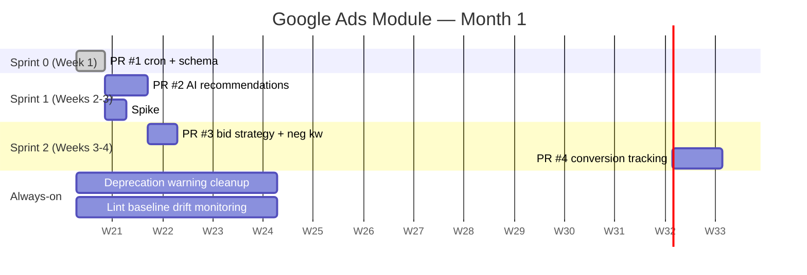

# Google Ads Module — Engineering Audit

| Field | Value |
|---|---|
| **Author** | Shui Lin (`shui.lin@jytech.us`) |
| **Audit date** | 2026-05-19 |
| **Branch audited** | `main` @ `cc44538` |
| **Audit scope** | `lib/google-ads*.ts`, `app/api/google-ads/`, `app/api/cron/google-ads-*`, `app/[locale]/dashboard/google-ads/`, `lib/credits.ts`, `lib/billing.ts`, related DB tables |
| **Status** | Read-only audit — no code changed, no PR opened |

---

## 1. Executive Summary

The Google Ads module in `autoclaw-web` is **not greenfield**. It is a substantial in-flight MVP comprising roughly **~6,500 lines of code** across API client, REST endpoints, dashboard UI, sync/reconcile workers, and credit-ledger plumbing.

**What works today** (proven by code, not by live verification):

- Full Google Ads API **v20** client with OAuth refresh-token flow and `login-customer-id` (MCC) header support.
- Campaign create / read / update / pause / close for `SEARCH`, `DISPLAY`, `SHOPPING`, `VIDEO` channels.
- Ad group, responsive search ad, responsive display ad, video ad, keyword creation — all callable from the dashboard UI.
- AI-generated ad copy + AI-generated keyword recommendations from a single landing-page URL.
- **An org-level ad-credit ledger with two-tier markup (payment gateway fee + platform fee), per-campaign reserve, auto-pause at cap, and daily reconciliation.** This is the most differentiated piece of the module versus competitors.
- Frontend covering campaign list, create form (with geo-target autocomplete), and a detail page with ~1,968 lines of in-product CRUD for ad groups, ads, keywords, audiences, locations, status, schedule, budget.

**What does not work / is missing** (in priority order):

1. **The sync and reconcile cron endpoints exist but are not scheduled.** `cron-maintenance.yml` does not invoke `/api/cron/google-ads-sync` or `/api/cron/google-ads-reconcile`. As a result, spend is never pulled, auto-pause never fires, and the ledger drifts in production.
2. **DB schema for `ad_accounts`, `campaigns`, `ad_credits`, `ad_credit_transactions` is created at runtime by `ensureAdsTables()` / `ensureAdCreditsTables()`**, not declared in `lib/schema.sql`. There is no single source of truth for schema.
3. **OAuth credentials are global, single-customer.** All users share one `GOOGLE_ADS_CUSTOMER_ID`. There is no per-org account connection flow — a blocker for the stated agency / multi-client direction.
4. **No conversion tracking, no negative keywords, no bid-strategy switcher, no day-parting, no AI optimization recommendations.** These are table-stakes in WordStream / Optmyzr / Adzooma and absent here.
5. **Meta Ads scaffold does not exist.** The `campaigns.platform` and `ad_accounts.platform` columns are already polymorphic, so structurally it is ready to host a second platform, but no Meta-side code is present.

**Recommendation**: ship a single low-risk first PR (Section 9) that wires up the cron schedule and lifts the schema into `lib/schema.sql`. This is one day of work, zero business risk, and unblocks every subsequent feature that depends on accurate spend data.

---

## 2. Architecture Overview

### 2.1 Mermaid diagram

```mermaid
flowchart TB
    subgraph Browser["Browser"]
        ListPage["app/[locale]/dashboard/google-ads/page.tsx<br/>(781 lines — list, create form, topup)"]
        DetailPage["app/[locale]/dashboard/google-ads/[id]/page.tsx<br/>(1968 lines — full CRUD)"]
    end

    subgraph NextAPI["Next.js API routes — app/api/google-ads/"]
        Campaigns["campaigns/route.ts<br/>(list / create + auto-CREATE TABLE)"]
        CampaignId["campaigns/[id]/route.ts<br/>(GET detail / PATCH name·budget·status·schedule)"]
        AdGroups["campaigns/[id]/ad-groups/route.ts"]
        Ads["campaigns/[id]/ads/route.ts (Search)"]
        DisplayAds["campaigns/[id]/display-ads/route.ts"]
        VideoAds["campaigns/[id]/video-ads/route.ts"]
        Keywords["campaigns/[id]/keywords/route.ts"]
        Locations["campaigns/[id]/locations/route.ts"]
        Audiences["campaigns/[id]/audiences/route.ts"]
        Discover["campaigns/discover/route.ts<br/>(list all Google-side campaigns)"]
        Import["campaigns/import/route.ts<br/>(claim existing campaign)"]
        Sync["campaigns/sync/route.ts<br/>(manual sync)"]
        Diagnose["diagnose/route.ts<br/>(account-link / billing check)"]
        Geo["geo-targets/route.ts<br/>(geo search proxy)"]
        AdCopyGen["ad-copy/generate/route.ts<br/>(landing → AI → headlines + keywords)"]
    end

    subgraph Lib["lib/"]
        GA["lib/google-ads.ts<br/>(1539 lines — API v20 client)"]
        Sync2["lib/google-ads-sync.ts<br/>(203 lines — spend sync + reconcile)"]
        Credits["lib/credits.ts<br/>(reserve / spend / release / ledger)"]
        Billing["lib/billing.ts<br/>(gateway fee + platform fee)"]
        AI["lib/ai.ts<br/>(multi-provider chatWithAI)"]
    end

    subgraph Cron["Cron — app/api/cron/"]
        CronSync["google-ads-sync/route.ts<br/>(hourly intended — NOT SCHEDULED)"]
        CronReconcile["google-ads-reconcile/route.ts<br/>(daily intended — NOT SCHEDULED)"]
    end

    subgraph External["External"]
        GoogleAdsAPI["Google Ads API v20<br/>googleads.googleapis.com"]
        OAuth["oauth2.googleapis.com<br/>(refresh-token flow)"]
        LandingPage["User landing page<br/>(fetched for AI copy)"]
        AIProviders["Cerebras / NVIDIA / Google Gemini /<br/>OpenAI / Anthropic / Alibaba / OpenRouter"]
    end

    subgraph DB["Neon Postgres"]
        TblCampaigns["campaigns<br/>(runtime-created)"]
        TblAdAccounts["ad_accounts<br/>(runtime-created)"]
        TblCredits["ad_credits<br/>(runtime-created)"]
        TblLedger["ad_credit_transactions<br/>(runtime-created)"]
        TblAudit["audit_logs"]
    end

    subgraph GHA["GitHub Actions"]
        Workflow[".github/workflows/cron-maintenance.yml<br/>(does NOT include google-ads-* schedules)"]
    end

    ListPage --> Campaigns
    ListPage --> Discover
    ListPage --> Import
    ListPage --> Geo
    DetailPage --> CampaignId
    DetailPage --> AdGroups
    DetailPage --> Ads
    DetailPage --> DisplayAds
    DetailPage --> VideoAds
    DetailPage --> Keywords
    DetailPage --> Locations
    DetailPage --> Audiences
    DetailPage --> AdCopyGen

    Campaigns --> GA
    CampaignId --> GA
    AdGroups --> GA
    Ads --> GA
    DisplayAds --> GA
    VideoAds --> GA
    Keywords --> GA
    Locations --> GA
    Audiences --> GA
    Discover --> GA
    Import --> GA
    Sync --> Sync2
    Diagnose --> GA
    Geo --> GA
    AdCopyGen --> AI
    AdCopyGen --> LandingPage

    Campaigns --> Credits
    CampaignId --> Credits
    Import --> Credits
    Sync2 --> GA
    Sync2 --> Credits
    Credits --> Billing

    GA --> OAuth
    GA --> GoogleAdsAPI
    AI --> AIProviders

    Campaigns --> TblCampaigns
    Campaigns --> TblAdAccounts
    Credits --> TblCredits
    Credits --> TblLedger
    Campaigns --> TblAudit

    Workflow -.NOT WIRED.-> CronSync
    Workflow -.NOT WIRED.-> CronReconcile
    CronSync --> Sync2
    CronReconcile --> Sync2
```



### 2.2 Layer responsibilities

| Layer | Files | Responsibility |
|---|---|---|
| **API client** | `lib/google-ads.ts` (1539 lines) | OAuth, `adsSearchStream`, `adsMutate`, all Google Ads API v20 calls. Hard-codes `process.env.GOOGLE_ADS_CUSTOMER_ID`. |
| **Sync / reconcile** | `lib/google-ads-sync.ts` (203 lines) | Pulls spend, updates `spent_cents` / `reserved_cents`, auto-pauses at cap, releases unused reserve. `reconcileOrgSpend` checks ledger vs Google-reported spend daily. |
| **Credit ledger** | `lib/credits.ts` (230 lines), `lib/billing.ts` (59 lines) | Org-level `ad_credits` pool, `ad_credit_transactions` ledger, two-tier markup (gateway 2.9% + platform 5% PAYG, 0% subscription). |
| **REST endpoints** | `app/api/google-ads/*` (15 files, 1967 lines) | Bridge between dashboard UI and `lib/`. Every endpoint follows: `checkRateLimit` → `auth0.getSession` → `resolveOrgId` → call `lib/` → `logAudit`. |
| **Cron endpoints** | `app/api/cron/google-ads-{sync,reconcile}/route.ts` | Org-loop wrappers around `syncOrgGoogleAdsSpend` and `reconcileOrgSpend`. Guarded by `CRON_SECRET`. |
| **Dashboard UI** | `app/[locale]/dashboard/google-ads/page.tsx` (781 lines), `app/[locale]/dashboard/google-ads/[id]/page.tsx` (1968 lines) | List view + create form + topup; detail view with inline edit, ad-group/ad/keyword/audience/location CRUD, AI ad-copy generation. |

### 2.3 Data flow — happy paths

**Create-campaign flow**:
```
DashboardListPage → POST /api/google-ads/campaigns
  → ensureAdsTables (idempotent runtime CREATE TABLE)
  → resolveOrgId
  → applyPlatformMarkup(totalBudget, plan)
  → reserveForCampaign  (deduct from ad_credits pool, hold against campaign)
  → createCampaign (lib/google-ads.ts) →
      Google Ads API: campaignBudgets:mutate → campaigns:mutate → campaignCriteria:mutate (locations)
  → attachReserveReference  (link ledger row to platform_campaign_id)
  → logAudit("google_ads.create_campaign")
  → INSERT INTO campaigns
```

**Spend-sync flow (intended, currently not triggered)**:
```
GitHub Actions cron (NOT WIRED) → /api/cron/google-ads-sync
  → SELECT DISTINCT org_id FROM campaigns WHERE platform='google' AND closed=false
  → for each org: syncOrgGoogleAdsSpend
      → fetchCampaignSpend (lib/google-ads.ts) →
          Google Ads API: googleAds:searchStream (cost_micros over last 30 days)
      → UPDATE campaigns SET spent_cents = ?, reserved_cents = max(cap - spent, 0)
      → recordSpend (lib/credits.ts) — debits ad_credits pool with platform-marked-up cents
      → IF spent ≥ cap OR remaining < daily: setCampaignStatus('PAUSED'), mark closed=true, releaseReserve
```

**AI ad-copy flow**:
```
DashboardDetailPage → POST /api/google-ads/ad-copy/generate { url, channel, locale }
  → fetch(url) — 10s timeout, 2MB limit
  → htmlToText + extractTitle (regex strip, clip to 6000 chars)
  → buildSystemPrompt per channel (SEARCH | DISPLAY | VIDEO) with length constraints
  → chatWithAI (lib/ai.ts) — multi-provider fallback chain
  → parse JSON: { headlines[], longHeadline, descriptions[], businessName, keywords[]? }
  → return to UI for review/edit before submitting to Google Ads
```

---

## 3. Current Strengths

### 3.1 Google Ads API client coverage (90 %)

`lib/google-ads.ts` exports **22 functions and 8 interfaces** spanning OAuth, account discovery, geo targeting, campaign / ad-group / ad / keyword / audience / location mutation, and detail fetching. Notable:

| Capability | Function | Notes |
|---|---|---|
| OAuth token refresh with 60s safety margin | `getAccessToken` | Caches access token in module scope |
| MCC support | `adsHeaders` | Adds `login-customer-id` header when `GOOGLE_ADS_LOGIN_CUSTOMER_ID` is set |
| Universal GAQL search | `adsSearchStream` | Used by every read path |
| List all accessible customers | `listAccessibleCustomers` | Foundation for multi-account selector (not yet exposed) |
| Customer metadata | `fetchCustomerInfo` | currency, time zone, manager flag, test-account flag |
| Account links (YouTube, MC) | `fetchAccountLinks` | Used by `/api/google-ads/diagnose` |
| Geo target autocomplete | `suggestGeoTargets` | Powers list-view create form geo input |
| Full campaign detail | `fetchCampaignDetail` | Single endpoint returns settings, 30-day daily metrics, locations, audiences (with label resolution), ad groups, keywords, ads, asset groups (PMax) |
| Campaign lifecycle | `createCampaign`, `setCampaignStatus`, `setCampaignDailyBudget`, `setCampaignSchedule`, `renameCampaign` | Channel-aware bidding (manualCpc vs maximizeConversions for VIDEO) |
| Location targeting | `setCampaignLocations`, location reads from both `campaign_criterion` and `ad_group_criterion` (PMax / Demand Gen) | |
| Audience targeting | `setCampaignAudiences` | AGE_RANGE / GENDER / PARENTAL_STATUS / INCOME_RANGE / USER_INTEREST / TOPIC / USER_LIST / CUSTOM_AUDIENCE |
| Ad creation | `createResponsiveSearchAd`, `createResponsiveDisplayAd`, `createVideoAd` | Display ad also handles `createImageAssetFromUrl` |
| Keyword creation | `createKeywords` | BROAD / PHRASE / EXACT match types |
| Discovery + import | `listAllCampaigns` | Fallback to non-metric query when no spend in last 30 days |

### 3.2 Credit-ledger system (90 %)

`lib/credits.ts` + `lib/billing.ts` implement a financial primitive that **most competitors do not have at all**:

- Org-level `ad_credits` pool, denominated in cents, with `balance_cents` and `reserved_cents`.
- `ad_credit_transactions` ledger with types `topup` / `reserve` / `unreserve` / `spend` / `refund` / `adjustment`, every row also storing `balance_after_cents` and `reserved_after_cents` (no need to replay history to know state at any point).
- Two-tier markup, declared as basis points:
  - `PAYMENT_GATEWAY_FEE_BPS = 290` (2.9 % Stripe pass-through; the fixed $0.30 per top-up is absorbed by AutoClaw)
  - `PLATFORM_FEE_BPS_PAYG = 500` (5 % PAYG; waived for `enterprise / scale / growth / pro / premium / paid` plans)
- Sign-preserving rounding (`feeCents`) so refunds and adjustments behave correctly.
- **Per-campaign reserve isolation**: `campaigns.reserved_cents` is held against each campaign so one campaign overspending cannot drain reserves earmarked for others.
- **Auto-pause on cap**: `syncOrgGoogleAdsSpend` not only pauses when `spent ≥ cap`, but also when `remaining < daily_budget` (would overshoot next day's billing cycle).
- **Daily reconciliation**: `reconcileOrgSpend` checks both per-campaign drift (ledger vs Google-reported spend) and pool drift (`ad_credits.reserved_cents` vs `SUM(campaigns.reserved_cents)`), recording catch-up `spend` rows automatically.

### 3.3 AI ad-copy generation (85 %)

`POST /api/google-ads/ad-copy/generate` is unusually complete:

1. **Landing page fetch** with 10s `AbortController` timeout, 2 MB size cap, custom UA.
2. **HTML → text** via regex strip of `<script> <style> <noscript>`, HTML entity decode, whitespace collapse.
3. **Title extraction** for AI context.
4. **6000-char clip with word-boundary respect** to stay under the typical 8 k context window.
5. **Channel-aware prompt** (SEARCH / DISPLAY / VIDEO) with explicit length constraints — ≤ 30 chars per headline, ≤ 90 per description, ≤ 25 per business name.
6. **For SEARCH** the model is also asked to return 10–20 keywords with recommended match types.
7. **Locale-aware**: prompts ask the model to mirror the landing-page language (zh / ko / en).
8. Returns JSON ready to be edited and submitted to Google Ads.

### 3.4 Dashboard UI coverage (80 %)

`app/[locale]/dashboard/google-ads/[id]/page.tsx` is the largest single file in the repo (1968 lines) and exposes:

- Inline edit of `name`, `dailyBudget`, `schedule` with optimistic save.
- Pause / Enable / Close actions with audit logging.
- Location management with geo autocomplete.
- Audience management across 8 criterion types.
- Ad group create.
- Search ad create (with AI-generated headline / description / keyword review flow).
- Display ad create (with image asset upload).
- Video ad create (with YouTube video link).
- Keyword add (with match-type selection).
- 30-day metrics: impressions, clicks, cost, conversions, CTR, avg CPC.

---

## 4. Technical Debt

| ID | Debt | Location | Severity | Effort to fix |
|---|---|---|---|---|
| D-1 | Cron endpoints exist but no scheduler invokes them | `.github/workflows/cron-maintenance.yml` (missing entries) | **Critical** | 30 min |
| D-2 | Schema declared at runtime, not in `lib/schema.sql` | `app/api/google-ads/campaigns/route.ts` `ensureAdsTables()`, `lib/credits.ts` `ensureAdCreditsTables()` | High | 2 h |
| D-3 | `app/[locale]/dashboard/google-ads/[id]/page.tsx` is 1968 lines — single monolithic client component | as named | Medium | 2–3 d (risky refactor) |
| D-4 | `COUNTRIES` constant hard-codes 20 entries; production needs full list | `lib/google-ads.ts:249` | Low | 1 d |
| D-5 | Every endpoint duplicates `getIp` / `checkRateLimit` / `auth0.getSession` / `resolveOrgId` boilerplate | All 15 files in `app/api/google-ads/` | Medium | 1 d (write `withGoogleAdsAuth` wrapper) |
| D-6 | No unit tests for Google Ads code | (none) | Medium | ongoing |
| D-7 | i18n dictionary keys may be incomplete for `googleAdsPage`; non-`en` locales need a sweep | `lib/i18n/{zh,zh-TW,ko}.ts` | Low | 0.5 d |
| D-8 | Lint errors on `app/[locale]/dashboard/x/page.tsx` and others that are not Google-Ads but are blockers for `npm run build` cleanliness | (multiple) | Medium | out of scope |
| D-9 | `lib/google-ads.ts` declares many `Row` types inline inside function bodies — they should be extracted | `lib/google-ads.ts` (passim) | Low | 0.5 d |
| D-10 | `app/api/cron/google-ads-sync/route.ts` iterates orgs sequentially without timeout budget | `app/api/cron/google-ads-sync/route.ts` | Medium | 0.5 d |

---

## 5. Production Risks

| Risk | Cause | Probability | Impact | Mitigation |
|---|---|---|---|---|
| **Ledger drift** | D-1: no automated spend sync → `ad_credits.reserved_cents` and per-campaign `spent_cents` go stale → billing inaccurate | **High** (it is happening right now) | High | Wire `/api/cron/google-ads-sync` (hourly) and `/api/cron/google-ads-reconcile` (daily) into `cron-maintenance.yml` |
| **Runaway spend** | Auto-pause only fires if sync runs. Without sync (D-1), a campaign can blow through its cap | **High** | High (financial exposure to AutoClaw) | Same as above |
| **Schema drift between environments** | D-2: tables are created on first request → development DB and production DB end up with column-level drift if migrations are added unevenly | Medium | Medium | Lift schema to `lib/schema.sql`; document migration order |
| **Single customer ID = blast radius** | All AutoClaw users push campaigns into the same Google Ads `GOOGLE_ADS_CUSTOMER_ID`. One user's spend or policy violation can throttle / suspend the account for everyone | Medium | **High** (account-level suspension) | Implement per-org OAuth + `ad_accounts.credentials` (already a JSONB column on the table) |
| **OAuth refresh-token expiry** | Single shared refresh token has no rotation flow; if Google revokes it, every customer goes offline | Low | High | Per-org OAuth removes this single point of failure |
| **Concurrent ledger mutation** | `recordSpend` / `releaseReserve` are not wrapped in `sql.transaction(...)` in all call sites | Medium | Medium | Audit `lib/credits.ts` for atomicity |
| **AI ad-copy returning invalid lengths** | Multi-provider fallback chain in `lib/ai.ts` may use a model that ignores length constraints. Google Ads will reject the mutate | Medium | Low (user sees error in UI) | Add post-validation in `ad-copy/generate/route.ts` and silently truncate |
| **No conversion data → AI optimization is impossible** | Google Ads optimization presupposes conversion tracking; AutoClaw does not configure conversion actions yet | Certain | Blocks Phase 2 features | Build conversion-tracking config flow |

---

## 6. Strategic Gaps vs Direction

Per Weijing's direction, the long-term shape is *"a real Google / Meta Ads automation platform where users heavily use Google Ads inside AutoClaw"* plus *"future Meta Ads integration, multi-client / agency workflows, AI-assisted marketing operations, scalable SaaS architecture"*.

| Strategic target | Current state | Gap | Source |
|---|---|---|---|
| Heavy in-product Google Ads usage | Create / read / edit / metrics ✅. Optimization / experiments / conversion tracking ❌ | **~30 %** | Section 3, Section 4 |
| AI automation | Ad copy + keyword generation ✅. Optimization recommendations, smart bidding, anomaly alerts ❌ | **~50 %** | Section 3.3 |
| Multi-client / agency support | `ad_accounts` table + `platform` column are polymorphic ✅. Per-org OAuth, MCC dashboard, sub-account picker ❌ | **~80 %** | Section 5 risk, Section 4 D-2 |
| Future Meta Ads integration | `campaigns.platform` column is platform-agnostic ✅. No `lib/meta-ads.ts`, no `app/api/meta-ads/*` ❌ | **~70 %** | Section 1 |

---

## 7. Recommended PR Roadmap

Ranked by **(value to strategy) ÷ (effort × risk)**. Each row is one PR.

| # | PR title | Files touched | Effort | Risk | Strategic value | Notes |
|---|---|---|---|---|---|---|
| 1 | `chore: wire google-ads cron + lift schema into schema.sql` | `.github/workflows/cron-maintenance.yml`, `lib/schema.sql`, `app/api/google-ads/campaigns/route.ts` (remove runtime CREATE TABLE), `lib/credits.ts` (ditto) | 1 d | **Low** | Medium (production readiness, unblocks #2 onwards) | First PR — see Section 9 |
| 2 | `feat(google-ads): AI optimization recommendations` | New `app/api/google-ads/campaigns/[id]/recommendations/route.ts`, new section in detail page, prompt template in a constants file | 2–3 d | Low | **High** | Reuses chat orchestrator pattern; reads 30-day metrics, returns ranked recommendations |
| 3 | `feat(google-ads): bid strategy switcher + negative keywords` | `lib/google-ads.ts` (add `setCampaignBidStrategy`, `createNegativeKeywords`), `app/api/google-ads/campaigns/[id]/bid-strategy/route.ts`, `app/api/google-ads/campaigns/[id]/negative-keywords/route.ts`, detail page UI | 2–3 d | Low | Medium | Closes the table-stakes gap vs WordStream / Optmyzr |
| 4 | `feat(google-ads): conversion tracking configuration` | `lib/google-ads.ts` (add `createConversionAction`, `listConversionActions`), `app/api/google-ads/conversions/route.ts`, `app/api/google-ads/conversions/[id]/route.ts`, new dashboard subsection | 4–5 d | Medium | **High** | Prereq for ROAS-aware AI optimization |
| 5 | `chore: per-org Google Ads OAuth + ad_accounts.credentials` | New `app/api/google-ads/oauth/start/route.ts`, `oauth/callback/route.ts`, encryption via `lib/crypto.ts`, removes hard-coded `GOOGLE_ADS_CUSTOMER_ID` | 1–2 w | **High** | **High** | Unblocks agency mode; touches every Google Ads endpoint |
| 6 | `feat: Meta Ads scaffold (lib + API routes + dashboard stub)` | `lib/meta-ads.ts` skeleton, `app/api/meta-ads/*` stubs, `app/[locale]/dashboard/meta-ads/page.tsx` placeholder, reuse `campaigns` table with `platform='meta'` | 1–2 w | Medium | **High** | First half can ship without Meta API integration as a stand-in pattern |
| 7 | `feat(google-ads): MCC / multi-account dashboard view` | New top-level route showing all linked `ad_accounts` per org, switch between them | 1 w | Medium | High | Depends on #5 |
| 8 | `feat(google-ads): A/B experiments via Google Ads experiments API` | `lib/google-ads.ts` experiments helpers, experiments UI on detail page | 1–2 w | Medium | Medium | Differentiator for power users |
| 9 | `feat(google-ads): performance report export (CSV + PDF)` | New `app/api/google-ads/reports/export/route.ts`, reuse `pdf` skill | 3–5 d | Low | Medium | Often the trigger for sales conversations |
| 10 | `chore: refactor google-ads detail page` | Split 1968-line `[id]/page.tsx` into 6–8 sub-components | 2–3 d | **High** | Low | Defer until at least 3 of #2–#6 are done — refactor on stable surface area |

---

## 8. Suggested Sprint Priorities

Two-week sprint cadence, one engineer (Shui).

### Sprint 0 (this week) — Foundation

- PR #1 only. Merge and verify in production that hourly sync runs and `ad_credit_transactions` shows a `spend` row for at least one active campaign.

### Sprint 1 — High-value AI

- PR #2 (AI optimization recommendations) — large user-visible win, low risk, reuses existing patterns.
- Spike on conversion-tracking API surface (read Google docs, sketch endpoints) so PR #4 can start cleanly.

### Sprint 2 — Table-stakes catch-up

- PR #3 (bid strategy + negative keywords) — required for any user comparing to competitors.

### Sprint 3 — Conversion tracking

- PR #4. After this lands, AutoClaw can credibly claim "ROAS-aware".

### Sprint 4–5 — Agency mode

- PR #5 (per-org OAuth). This is the largest architecture shift in the audit — plan in detail before starting.

### Sprint 6 — Meta scaffold

- PR #6, in parallel with optimization work on Google side once #4 has lived in prod for a sprint.

---

## 9. Recommended First PR

**Title**: `chore: wire google-ads cron schedule + lift dynamic schema into schema.sql`

**Branch**: `feature/google-ads-cron-and-schema`

**Why this one first**

1. Closes the highest production risk (D-1, runaway-spend).
2. One day of work, single reviewer, low blast radius.
3. Establishes the conventions (audit doc → ticket → PR → merge) for every subsequent PR.
4. Unblocks every later feature that needs accurate `spent_cents`.

**Files to change**

| File | Change |
|---|---|
| `.github/workflows/cron-maintenance.yml` | Add two `cron:` entries (`0 * * * *` for sync, `30 2 * * *` for reconcile) and two matching `Run google-ads-sync` / `Run google-ads-reconcile` steps modeled on the existing `Run sync-openclaw` step |
| `lib/schema.sql` | Append `CREATE TABLE IF NOT EXISTS ad_accounts (...)`, `campaigns (...)`, `ad_credits (...)`, `ad_credit_transactions (...)` lifted verbatim from `ensureAdsTables()` and `ensureAdCreditsTables()` |
| `app/api/google-ads/campaigns/route.ts` | Remove the `ensureAdsTables()` call and the function body. Add `// schema lives in lib/schema.sql` comment |
| `lib/credits.ts` | Remove `ensureAdCreditsTables` invocations from call sites; keep the function but mark `@deprecated` for one release |
| `docs/google-ads-audit.md` | (this file) — add a "Resolved" row to D-1 and D-2 once PR merges |

**Tests / verification plan**

1. Local: `npm run lint` (expect same baseline; we are not introducing new lint errors).
2. Local: `npm run test` (Google Ads has no tests; existing chat tests remain).
3. Local: run `psql $DATABASE_URL < lib/schema.sql` on a fresh Neon dev branch and confirm `\dt ad_credits`, `\dt ad_credit_transactions`, `\dt ad_accounts`, `\dt campaigns` all exist with expected columns.
4. Local: hit `GET /api/google-ads/campaigns` to confirm it no longer needs `ensureAdsTables`.
5. After deploy: trigger the workflow manually via `workflow_dispatch` with `task=google-ads-sync`; verify a 200 response and a fresh `ad_credit_transactions` row.

**Risks**

| Risk | Mitigation |
|---|---|
| Existing production DB already has the tables → `CREATE TABLE IF NOT EXISTS` is idempotent → safe | None needed |
| Existing production DB diverges from schema.sql (extra columns from `ALTER TABLE ADD COLUMN`) | The `ALTER TABLE` statements should also be appended to `lib/schema.sql` so it remains the source of truth. Verify each ADD column against a `\d campaigns` from the production DB before merging |
| Hourly cron might overshoot Vercel function limit on orgs with many campaigns | `app/api/cron/google-ads-sync/route.ts` sets `maxDuration = 300` — sufficient for ~30 orgs at 5 s each. If the project later grows beyond that, batching belongs in a follow-up PR (not this one) |

**Acceptance criteria**

- Workflow file passes `actionlint` (or visually matches the `sync-openclaw` step format).
- `lib/schema.sql` ends with a "Google Ads / Ad Credits" section that fully replaces the runtime `CREATE TABLE` calls.
- New developer running `psql < lib/schema.sql` on a fresh Neon database can immediately hit `GET /api/google-ads/campaigns` and see an empty list, not a 500.
- One `workflow_dispatch` invocation of `google-ads-sync` returns 200 with a JSON body containing `summaries`.

**Commit message** (recommended)

```
chore: wire google-ads cron + lift dynamic schema into schema.sql

- Add hourly google-ads-sync and daily google-ads-reconcile schedules
  to .github/workflows/cron-maintenance.yml.
- Move runtime CREATE TABLE for ad_accounts, campaigns, ad_credits,
  ad_credit_transactions from app/api/google-ads/campaigns/route.ts
  and lib/credits.ts into lib/schema.sql so the schema has a single
  source of truth.
- Mark ensureAdCreditsTables() @deprecated; remove the call site in
  the campaigns route. The function body is kept for one release in
  case any production DB still relies on first-request creation.

Closes D-1, D-2 in docs/google-ads-audit.md.
```

---

## 10. Recommended Week 1 Plan

| Day | Focus |
|---|---|
| **Mon** | Share this audit with Weijing; align on the priority order in Section 7. Open the ticket for PR #1. |
| **Tue** | Branch + implement PR #1. Verify locally per Section 9 verification plan. |
| **Wed** | Open PR #1. Request review. While waiting, read the Google Ads `RecommendationService` API documentation for PR #2. |
| **Thu** | PR #1 merged. Verify in production that `workflow_dispatch` invocation of `google-ads-sync` succeeds and a real `ad_credit_transactions` row appears. Open ticket for PR #2 with an outline of the recommendation categories (Keyword, Bid, Budget, Ad Strength, Audience). |
| **Fri** | Start PR #2 (AI optimization recommendations) — scaffold the endpoint and the prompt template. Stop coding by EOD, document what was learned in a `## Day 5 notes` block on the ticket. |

By Friday EOD:
- One merged PR (D-1, D-2 resolved).
- One in-flight ticket with concrete outline.
- Boss-visible signal: cron is running, ledger is moving, audit doc is in `docs/`.

---

## 11. Recommended Month 1 Roadmap



**Month 1 deliverables**

1. PR #1 merged → spend sync runs every hour, ledger reconciles every day.
2. PR #2 merged → AI optimization recommendations surface in detail page (Keyword / Bid / Budget / Ad / Audience categories).
3. PR #3 merged → bid strategy switcher (Target CPA, Target ROAS, Maximize Clicks, Manual CPC, Enhanced CPC) + negative keyword management.
4. PR #4 merged or in-review → conversion tracking config flow (Google Ads `conversion_action` CRUD wired into the dashboard).
5. Audit doc updated with a "Resolved" status next to D-1, D-2, and the table-stakes gaps that are now closed.

**Out of scope for Month 1**

- Per-org OAuth (PR #5) — too large; needs its own spec doc and design review before implementation.
- Meta Ads scaffold (PR #6) — wait until the Google Ads side is stable enough to template from.
- Refactor of `[id]/page.tsx` (PR #10) — risky and not user-visible.

---

## 12. Environment Variables

Required for any Google Ads code path to function (all are inferred from grep of `process.env.GOOGLE_ADS_*`):

| Variable | Purpose | Where read |
|---|---|---|
| `GOOGLE_ADS_CLIENT_ID` | OAuth client | `lib/google-ads.ts:12` |
| `GOOGLE_ADS_CLIENT_SECRET` | OAuth client secret | `lib/google-ads.ts:13` |
| `GOOGLE_ADS_REFRESH_TOKEN` | OAuth refresh token (single, shared) | `lib/google-ads.ts:14` |
| `GOOGLE_ADS_DEVELOPER_TOKEN` | Google Ads API developer token | `lib/google-ads.ts:44`, `lib/google-ads.ts:81`, `lib/google-ads.ts:191` |
| `GOOGLE_ADS_CUSTOMER_ID` | Default customer ID for all reads / writes | `lib/google-ads.ts` (every mutator / reader) |
| `GOOGLE_ADS_LOGIN_CUSTOMER_ID` | MCC manager ID, optional | `lib/google-ads.ts:52` |

Also relevant (already documented in the project-wide `README.md`):

- `CRON_SECRET` — Bearer token gate for cron endpoints.
- `DATABASE_URL` — Neon Postgres connection.

---

## 13. Open Questions for Weijing

These should be asked before starting any PR beyond #1.

1. Is the long-term plan to keep a single shared `GOOGLE_ADS_CUSTOMER_ID` (AutoClaw acts as the agency), or to allow each customer to bring their own Google Ads account (per-org OAuth)? This decision changes PR #5's design.
2. For conversion tracking (PR #4): are we expected to support the full `conversion_goals` + `conversion_actions` surface, or only website conversions (gtag.js / pixel)?
3. What channel mix is most important for the immediate user base — Search-heavy SMB, Display-heavy brand, Performance Max, or Demand Gen? `DEMAND_GEN` is currently labeled `CHANNELS_DISABLED_FOR_API_CREATE` in the UI — should we lift that restriction?
4. What is the policy for AI optimization recommendations — surface as suggestions only (user accepts manually), or one-click apply, or fully autonomous after a confidence threshold?
5. For Meta Ads (PR #6): is the scope Meta Ads only, or eventually TikTok Ads + LinkedIn Ads as well? `marketplace/{amazon,etsy,...}` directories already exist in the dashboard, hinting at broader ambition.

---

**End of audit.** Updates to this document should be made by appending a `## Changelog` section at the bottom rather than editing earlier sections in place — that way the audit remains a snapshot of `cc44538` while still being a live planning artifact.

---

## Changelog

Appended per the convention above. Earlier sections remain a snapshot of `cc44538`.

### 2026-06-30 — status reconciliation + PR #2

Between the audit date (2026-05-19) and today, several items landed via teammate PRs and are now merged into `main` (`10d25c3`):

- **D-1 — RESOLVED.** `.github/workflows/cron-maintenance.yml` now schedules `google-ads-sync` (hourly, `40 * * * *`) and `google-ads-reconcile` (daily, `45 3 * * *`), each wired as a schedule entry, a `Run` step, and a `workflow_dispatch` option. Landed in `ac2b8e6` (also see `d15456c`). The runaway-spend / ledger-drift risk in Section 5 is closed for the shared-account setup.
- **D-2 — RESOLVED.** The four ad tables (`ad_accounts`, `campaigns`, `ad_credits`, `ad_credit_transactions`) now live in `lib/schema.sql` (`27ba0fa`). `app/api/google-ads/campaigns/route.ts` no longer calls `ensureAdsTables()`. Leftover: `ensureAdCreditsTables()` in `lib/credits.ts` is still defined but has no remaining call sites — safe to delete in a cleanup pass.
- **PERFORMANCE_MAX** channel added to `createCampaign` and the creation UI (`d2f67d6`, `0ce78c0`) — beyond the original roadmap.
- **PMAX asset groups** (KAN-53) shipped end-to-end: schema + types → validation → `createAssetGroup()` → upload UI + API (`b0a61d1` → `c004c24`).
- **Read-only spend/budget redaction** for sandbox/viewer accounts on the Google Ads dashboard (`0e6b9be`).

### 2026-06-30 — PR #2: AI optimization recommendations (this PR)

Implements Section 7 PR #2. New endpoint returns a ranked, campaign-specific list of optimization recommendations generated from live 30-day metrics.

- `app/api/google-ads/campaigns/[id]/recommendations/route.ts` — `POST`. Auth + org check (campaign must belong to the caller's org), tight rate limit (10/min, matching `ad-copy/generate`), pulls `fetchCampaignDetail`, builds a numeric snapshot (30-day rollup + last-7-vs-prior-7 trend + structure counts), calls `chatWithAI`, parses/validates/clamps the JSON, sorts HIGH→MEDIUM→LOW, and logs `google_ads.recommendations`. No DB mutation.
- `app/api/google-ads/campaigns/[id]/recommendations/prompt.ts` — prompt template + `Recommendation` / `CampaignSnapshot` types + category/priority enums, isolated for tuning and testing.
- `lib/audit.ts` — added the `google_ads.recommendations` audit action.
- Categories: `BUDGET`, `BID`, `KEYWORD`, `AD_STRENGTH`, `AUDIENCE`, `TARGETING`. Prompt is locale-aware (zh / ko / en) and instructs the model to recommend conversion-tracking setup when conversions are absent — a natural lead-in to PR #4.

Follow-up (not in this PR): surface the recommendations in the detail page UI (`app/[locale]/dashboard/google-ads/[id]/page.tsx`), respecting the `isReadOnly` gate added in `0e6b9be`.

### 2026-07-02 — PR #3: bid strategy switching + negative keywords (this PR)

Implements Section 7 PR #3 — the two highest-impact competitor-parity gaps after AI recommendations.

**Bid strategy switching**

- `lib/google-ads.ts` — `setCampaignBidStrategy()` + pure `validateBidStrategyInput()` / `allowedBidStrategies()` (unit-tested). Six strategies: `MANUAL_CPC`, `MAXIMIZE_CLICKS` (→ `target_spend`), `MAXIMIZE_CONVERSIONS`, `TARGET_CPA`, `MAXIMIZE_CONVERSION_VALUE`, `TARGET_ROAS`. Targets are implemented per Google's smart-bidding migration: tCPA rides on `maximize_conversions.target_cpa_micros`, tROAS on `maximize_conversion_value.target_roas`. Channel rules mirror `createCampaign`'s constraints: VIDEO → conversions-based only; PMax → Smart Bidding only; DEMAND_GEN → no manual CPC.
- `fetchCampaignDetail()` now returns `bidding` (`bidding_strategy_type` + targets) so the UI can display the live strategy.
- `app/api/google-ads/campaigns/[id]/bid-strategy/route.ts` — `POST { type, targetCpa?, targetRoas? }`. Standard auth/org/closed checks, audit-logged as `sub_action: set_bid_strategy`.
- Detail page: strategy chip (🎯) in the header meta row with inline editor (select + conditional target input), options filtered by channel.

**Campaign-level negative keywords**

- `lib/google-ads.ts` — `addCampaignNegativeKeywords()` (campaign_criterion, `negative: true`, partialFailure with duplicate detection, mirroring `createKeywords`), `removeCampaignNegativeKeyword()` (resource-name validated), `channelSupportsNegativeKeywords()` (SEARCH/DISPLAY/SHOPPING/VIDEO; PMax excluded — its negatives use account-level lists, deferred).
- `fetchCampaignDetail()` returns `negativeKeywords` with `resourceName` per entry (needed for removal).
- `app/api/google-ads/campaigns/[id]/negative-keywords/route.ts` — `POST { keywords[] }` / `DELETE { resourceName }`. DELETE cross-checks that the criterion belongs to this campaign's customer AND this campaign's numeric id (`{campaignId}~{criterionId}`).
- Detail page: "Negative Keywords" card (shown for supported channels even when empty), red chips with per-keyword remove, add form with `[exact]/[phrase]/[broad]` per-line override — same syntax as the ad-group keyword form.

**Misc**

- `lib/google-ads.test.ts` — 19 new assertions covering bid-strategy validation, channel rules, and negative-keyword channel gating.
- i18n: 10 new `googleAdsPage` keys × 4 locales (en / zh / zh-TW / ko).
- Section 6's "Bid strategy management" and "Negative keywords" gaps are now closed; remaining from that table: conversion tracking (PR #4), asset library, day parting, experiments, MCC, report exports.

### 2026-07-03 — PR #2 follow-up: recommendations UI (this PR)

Closes the follow-up noted in the PR #2 changelog entry: the recommendations endpoint is now surfaced in the campaign detail page.

- New "✨ AI Optimization Recommendations" card between Budget and Targeting on `app/[locale]/dashboard/google-ads/[id]/page.tsx`. On-demand (button-triggered POST — no auto-fire on page load, respecting the endpoint's 10/min rate limit and LLM cost), renders ranked cards with priority badge (HIGH red / MEDIUM amber / LOW gray), category + target-metric chips, rationale, and a concrete action line; footer shows generation timestamp. Regenerate supported.
- Locale passed through so recommendations come back in the user's language (zh / ko / en per the prompt design).
- i18n: 7 new `googleAdsPage` keys × 4 locales. No API changes, no DB changes.

### 2026-07-03 — PR #4a: conversion tracking, backend (this PR)

First half of Section 7 PR #4, scoped per open question #2 to **website conversions** (gtag) — the 90% case. UI lands in PR #4b.

- `lib/google-ads.ts` — `listConversionActions()` (non-removed actions incl. `tag_snippets` filtered to HTML page format, so callers get the global site tag + event snippet for install), `createConversionAction()` (type WEBPAGE, ENABLED; value settings default to "no fixed value" unless `defaultValueUsd` given, in which case `alwaysUseDefaultValue: true`; optional `clickThroughLookbackWindowDays`), `setConversionActionStatus()` (ENABLED/PAUSED/REMOVED, resource-name validated), plus pure `validateConversionActionInput()` (unit-tested: name ≤100, category/countingType enums, value ≥0, lookback 1-90 integer).
- Exposed category subset: PURCHASE, SIGNUP, LEAD, SUBMIT_LEAD_FORM, CONTACT, PAGE_VIEW, DOWNLOAD, ADD_TO_CART, BEGIN_CHECKOUT, SUBSCRIBE_PAID. Counting: ONE_PER_CLICK (leads) / MANY_PER_CLICK (purchases).
- `app/api/google-ads/conversion-actions/route.ts` — GET (list) / POST (create). Account-level resource on the shared customer, so auth requires an org member (same trust boundary as `diagnose`) rather than campaign ownership.
- `app/api/google-ads/conversion-actions/[id]/route.ts` — PATCH status.
- `lib/google-ads.test.ts` — 9 new test cases for `validateConversionActionInput`.
- Note for PR #4b (UI) and beyond: recommendations prompt already nudges users toward conversion tracking when conversions are absent; once actions exist, VIDEO/PMax `maximizeConversions` bidding and the AI's CPA/ROAS advice become meaningful. Per-org conversion goal mapping is deferred to the per-org OAuth decision (open question #1).

### 2026-07-03 — PR #4b: conversion tracking, UI (this PR)

Second half of PR #4. Deliberately a **separate page** (`/dashboard/google-ads/conversions`) rather than another section in the 781-line list page or the 2,500-line detail page — conversion actions are account-level, and D-3 says stop feeding the monoliths.

- `app/[locale]/dashboard/google-ads/conversions/page.tsx` (~330 lines): list (name, status, category, counting badge, primary-for-goal, numeric id), per-action "Get tag code" expander showing the global site tag + event snippet with copy buttons and a 2-step install hint, create form (name / category / counting / optional value / optional 1-90d lookback), Pause / Enable / Remove (confirm dialog; REMOVED keeps history but stops counting).
- Mutations gated behind `!isReadOnly` (consistent with `0e6b9be`); read-only users can still view actions and tag code.
- List page: header now has a 🎯 Conversion Tracking link (visible to all roles); Import/Create buttons remain read-only-gated as before.
- i18n: 28 new keys × 4 locales. No API/DB changes — pure consumer of PR #4a.
- **PR #4 is now complete** → the audit's "Conversion tracking" competitor gap is closed for the shared-account setup. Remaining Section 6 gaps: asset library, day parting, experiments, MCC, report exports.

### 2026-07-03 — day parting / ad schedule (this PR)

Closes the Section 6 "Day parting" gap.

- `lib/google-ads.ts` — `setCampaignAdSchedule()` (replace-all AD_SCHEDULE campaign criteria; empty list = run at all times; whole hours only, `startMinute`/`endMinute` fixed to ZERO — :15/:30/:45 deferred), `channelSupportsAdSchedule()` (SEARCH/DISPLAY/SHOPPING/VIDEO; PMax and Demand Gen schedule automatically and reject the criterion), pure `validateAdScheduleInput()` (day enum, integer hours 0-23/1-24, end > start, ≤6 intervals/day, no same-day overlaps — back-to-back allowed). `fetchCampaignDetail()` returns `adSchedules`.
- `app/api/google-ads/campaigns/[id]/ad-schedule/route.ts` — `POST { schedules[] }`, replace-all semantics, standard auth/org/closed/channel checks, audit-logged.
- Detail page: "⏰ Ad Schedule" card — view chips (`Mon 09:00–18:00`), editor with per-row day/start/end selects, "Mon–Fri 9–18" preset, clear-to-always-on, add/remove intervals.
- `lib/google-ads.test.ts` — 10 new test cases (presets, back-to-back boundaries, overlap/limit rejection, channel gating). i18n: 6 keys × 4 locales.
- Bid modifiers per interval (e.g. +20% weekday mornings) deferred — noted for a future bid-adjustment pass alongside device/location modifiers.

### 2026-07-03 — CSV report exports (this PR)

Chips away at the Section 6 "Reporting/export" gap with client-side CSV exports (no backend, no new API surface).

- `lib/csv.ts` — dependency-free RFC 4180 helpers: `csvEscape` (quotes commas/quotes/newlines), `toCsv` (CRLF + explicit `` BOM so Excel renders CJK campaign names correctly), `downloadCsv` (browser-only, no-op on server).
- List page: "⬇ Export CSV" next to Sync — all campaigns with id/name/channel/status/closed/daily budget/cap/spent/reserved/created. Hidden for read-only roles (spend columns are redacted in that mode, so the export must be too).
- Detail page: "⬇ Export CSV" on the Performance header — the 30-day daily series (date/impressions/clicks/cost/conversions), filename slugged from the campaign name.
- `lib/csv.test.ts` — 8 test cases. i18n: 1 key × 4 locales.
- PDF/scheduled email reports deferred; CSV covers the "pull numbers into a spreadsheet/deck" workflow that sales asked for.

### 2026-07-03 — device bid adjustments (this PR)

Delivers the device half of the bid-modifier pass promised in the day-parting changelog entry.

- `lib/google-ads.ts` — `setCampaignDeviceModifiers()` (replace-all DEVICE campaign criteria; percent → factor `1 + pct/100` rounded to 2dp; `exclude` → `bid_modifier: 0`, Google's device opt-out; percent 0 without exclude emits no criterion = default), `channelSupportsDeviceModifiers()` (SEARCH/DISPLAY/SHOPPING — VIDEO only supports exclusion semantics and PMax/DemandGen none, kept out), pure `validateDeviceModifiers()` (device enum, no duplicates, -90..900, can't exclude every device). `fetchCampaignDetail()` returns `deviceModifiers`.
- `app/api/google-ads/campaigns/[id]/device-modifiers/route.ts` — `POST { modifiers[] }`, replace-all, standard checks, audit-logged.
- Detail page: "📱 Device Bid Adjustments" card — chips (green boost / amber reduction / red strikethrough exclusion / gray default), editor with per-device mode select (default / adjust ± % / exclude).
- `lib/google-ads.test.ts` — 9 new test cases. i18n: 4 keys × 4 locales.
- Remaining bid-modifier surface (location, ad-schedule interval, demographics) deferred until there's user pull.

### 2026-07-03 — sitelink extensions (this PR)

First slice of the Section 6 "asset library / extensions" gap: sitelinks, the highest-CTR-impact extension type.

- `lib/google-ads.ts` — `createCampaignSitelinks()` (two-step: `assets:mutate` creates sitelink assets → `campaignAssets:mutate` links them with `fieldType: SITELINK`), `removeCampaignSitelink()` (detaches the campaign_asset link only — the asset stays in the account for future reuse, which is the seed of a proper asset library), `channelSupportsSitelinks()` (SEARCH only; PMax consumes sitelinks via asset groups — deferred), pure `validateSitelinkInput()` (linkText ≤25 + case-insensitive dedupe, http(s) URL, descriptions both-or-neither ≤35, ≤20 per batch). `fetchCampaignDetail()` returns `sitelinks` (from `campaign_asset` joined to `asset`, non-removed only).
- `app/api/google-ads/campaigns/[id]/sitelinks/route.ts` — `POST { sitelinks[] }` / `DELETE { resourceName }` with the same double ownership check as negative keywords (`customers/{cid}/campaignAssets/{campaignId}~{assetId}~SITELINK`).
- Detail page: "🔗 Sitelinks" card (SEARCH campaigns) — list with link text / URL / descriptions and per-row remove, add form seeded with 2 rows (Google needs ≥2 to serve, hint shown when empty).
- `lib/google-ads.test.ts` — 10 new test cases. i18n: 12 keys × 4 locales.
- Other extension types (callouts, structured snippets, calls) follow the same asset + campaign_asset pattern — cheap follow-ups now that the plumbing exists.

### 2026-07-03 — callouts + structured snippets (this PR)

The promised cheap follow-up to sitelinks — same asset → campaign_asset plumbing, two more extension types.

- `lib/google-ads.ts` — `createCampaignCallouts()` (callout assets, ≤25 chars, case-insensitive dedupe, ≤20/batch), `createCampaignStructuredSnippet()` (fixed EN header enum from Google's 13 allowed values; 3-10 values ≤25 chars each), `removeCampaignExtensionAsset()` (regex-validated `…~(CALLOUT|STRUCTURED_SNIPPET)`; detach-only, assets kept), `channelSupportsTextExtensions()` (aliases the sitelink SEARCH-only rule). `fetchCampaignDetail()` returns `callouts` + `structuredSnippets`.
- `app/api/google-ads/campaigns/[id]/extensions/route.ts` — single route, `POST { kind: "callout" | "snippet", … }` / `DELETE { resourceName }`, same double ownership check as sitelinks.
- Detail page: "📣 Callouts & Snippets" card — callout chips (emerald) + snippet rows (`Header: v1 · v2 · v3`), two add forms (textarea one-per-line for callouts; header select + values textarea for snippets), per-item remove.
- `lib/google-ads.test.ts` — 11 new test cases. i18n: 10 keys × 4 locales.
- With sitelinks + callouts + snippets shipped, the high-value half of "extensions" is done; call/price/promotion extensions deferred until user pull.

### 2026-07-03 — search terms report + one-click negatives (this PR)

Closes the loop between reporting and the negative-keyword feature: see what actually triggered your ads, exclude waste in one click.

- `lib/google-ads.ts` — `fetchSearchTerms()` (last-30-days `search_term_view`, top 500 raw rows) + pure `aggregateSearchTermRows()` (case-insensitive term dedupe + metric summing, impressions-desc, limit — unit-tested since GAQL returns per-segment rows).
- `app/api/google-ads/campaigns/[id]/search-terms/route.ts` — `GET`, read-only. Closed campaigns allowed (historical data stays useful); SEARCH channel only.
- Detail page: "🔍 Search Terms" card — **load-on-demand** (button, not auto-fetch: `search_term_view` is one of the slower GAQL views and most visits don't need it). Table of term / impressions / clicks / cost / conversions with a per-row "− Negative" button that POSTs to the existing negative-keywords endpoint as EXACT match; rows already excluded show a gray "excluded" marker (matched against `detail.negativeKeywords`).
- `lib/google-ads.test.ts` — 5 new test cases for the aggregator. i18n: 11 keys × 4 locales.
- Nice follow-up someday: feed the top wasteful terms (high cost, zero conversions) into the AI recommendations prompt.

### 2026-07-03 — AI recommendations × wasteful search terms (this PR)

The "someday" from the previous entry, done the next hour. The recommendations engine can now name real money-burning queries instead of speaking in aggregates.

- `recommendations/prompt.ts` — `CampaignSnapshot.wastefulTerms` + pure `selectWastefulTerms()` (zero-conversion terms with actual spend, cost-desc, top 5). Prompt gains a "Wasteful search terms" section and a system rule to emit a KEYWORD recommendation naming the offenders (the search-terms card gives users the one-click negative button to act on it).
- `recommendations/route.ts` — for SEARCH campaigns, fetches the last-30d search terms best-effort inside a try/catch: `search_term_view` being slow or empty must never block recommendations.
- `recommendations/prompt.test.ts` — new test file, 5 cases (selection rules, cap, prompt inclusion/omission). First tests for the recommendations module.
- No UI/i18n changes — the existing recommendations card just gets sharper output.
